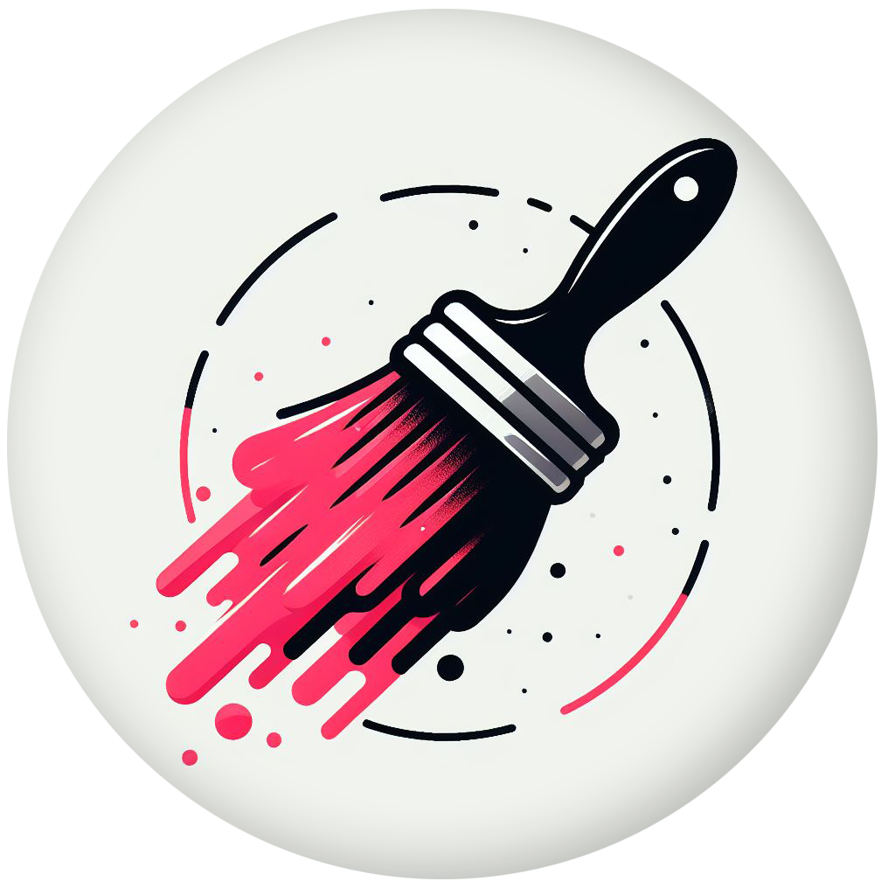

# OCMS Theme [](https://github.com/BrennoFruhauf/ocms-theme)
> Your VS Code with your favorite color.

Table of Contents

- [OCMS Theme ](#ocms-theme-)
	- [Color Themes](#color-themes)
	- [Previews](#previews)
	- [Add Your Custom Theme](#add-your-custom-theme)
	- [Installation](#installation)
	- [Configuration Suggestion](#configuration-suggestion)
	- [Feedback](#feedback)

## Color Themes

| Theme Name                | Color                                            | HEX     |
| ------------------------- | ------------------------------------------------ | ------- |
| OCMS Pink Sherbet         |  | #F68D9B |
| OCMS Red                  |  | #FF0000 |
| OCMS Electric Crimson     |  | #FF0040 |
| OCMS Vivid Raspberry      |  | #FF0073 |
| OCMS Vivid Violet         |  | #9D00FF |
| OCMS Electric Indigo      |  | #6200FF |
| OCMS Blue                 |  | #0800FF |
| OCMS Brandeis Blue        |  | #006AFF |
| OCMS Vivid Sky Blue       |  | #00CCFF |
| OCMS Sea Green (Crayola)  |  | #00FFD0 |
| OCMS Medium Spring Green  |  | #00FF99 |
| OCMS Guppie Green         |  | #00FF73 |
| OCMS Electric Green       |  | #00FF04 |
| OCMS Spring Bud           |  | #AAFF00 |
| OCMS Lemon Glacier        |  | #F2FF00 |
| OCMS Cyber Yellow         |  | #FFD000 |
| OCMS Orange Peel          |  | #FF9D00 |
| OCMS Blaze Orange         |  | #FF6A00 |
| OCMS Orange (Aerospace)   |  | #FF4D00 |
| OCMS Conquelicot          |  | #FF3700 |

## Previews

<div align="center">


.png)


.png)


</div>

## Add Your Custom Theme

1. Clone the repository to your local machine:
```shell
git clone https://github.com/BrennoFruhauf/ocms-theme.git
```
2. Open `themes.ts` and configure your theme. Example:
```ts
const schemes: Theme[] = [
  {
    // Name of your theme.
    name: 'your-theme-name', 

    // Your favorite color.
    color: '#FFF000',

    // "light" or "dark" scheme.
    scheme: "dark",

    // (Optional) Background Color. Default value is #131313.
    background: '#292200',

    // (Optional) Overwrite properties. Use Hex Alpha color or Color Object.
    override: {}
  }
]
```
3. Run the `npm run build` script to create your JSON.
4. To debug, add your theme to `package.json` and press `F5`:
```json
"contributes": {
  "themes": [
    {
      // Name of your theme.
      "label": "Your Theme Name",

      // "vs", "vs-dark", "hc-black" or "hc-light".
      "uiTheme": "vs-dark",

      // Path of your JSON file.
      "path": "./themes/${scheme}/${your-theme-name}.json"
    }
  ]
}
```

> If you want me to add it to the collection, please open a [request](https://github.com/BrennoFruhauf/ocms-theme/issues) with the generated theme data.

## Installation

1. Click `Ctrl + Shift + X` or `⌘ + Shift + X` to Open **Extensions** sidebar panel in Visual Studio Code.
2. Search for `OCMS Theme`
3. Click **Install**.
4. Click `Ctrl + Shift + P` or `⌘ + Shift + P` to `Show Command Palette`.
5. Type `theme` and choose `Preferences: Color Theme`.
6. Choose your favorite color theme.

## Configuration Suggestion

1. Click `Ctrl + Shift + P` or `⌘ + Shift + P` and Open `Preferences: Open User Settings (JSON)`.
2. Download and install [Fira Code Font](https://github.com/tonsky/FiraCode?tab=readme-ov-file#download--install).

```json
"editor.tabSize": 2,
"editor.fontSize": 13,
"editor.lineHeight": 1.8,
"editor.fontFamily": "'Fira Code', Consolas, 'Courier New', monospace",
```

3. Install [Symbols](vscode:extension/miguelsolorio.symbols) Extension.
```json
"workbench.iconTheme": "symbols",
"symbols.hidesExplorerArrows": false,
```

4. Install [Fluent Icons](vscode:extension/miguelsolorio.fluent-icons) Extension.
```json
"workbench.productIconTheme": "fluent-icons",
```

5. Install [APC Customize UI++](vscode:extension/drcika.apc-extension) Extension.
```json
"apc.header": {
  "height": 36
},
"apc.listRow": {
  "height": 26
},
"apc.electron": {
  "frame": false,
  "titleBarStyle": "hidden"
},
"apc.stylesheet": {
  ".pane-header": "padding: 0 8px;",
  ".title-label > h2": "display: none",
  ".monaco-list-row": "border-radius: 4px;",
  ".nosidebar .inline-tabs-placeholder": "width: 75px;",
  ".monaco-workbench .part.titlebar>.titlebar-container>.titlebar-center": "display: none !important;",
},
```

6. The following properties don't require any extensions.
```json
"workbench.tree.indent": 8,
"breadcrumbs.enabled": false,
"workbench.sideBar.location": "right",
"workbench.editor.labelFormat": "short",
"workbench.startupEditor": "newUntitledFile",

"editor.rulers": [80, 120],
"editor.insertSpaces": false,
"editor.fontLigatures": true,
"editor.minimap.enabled": false,
"editor.cursorBlinking": "expand",
"editor.scrollbar.vertical": "hidden",
"editor.renderLineHighlight": "gutter",
"editor.scrollbar.horizontal": "hidden",
"editor.cursorSmoothCaretAnimation": "on",
"editor.semanticHighlighting.enabled": false,
"editor.guides.bracketPairsHorizontal": false,
"editor.bracketPairColorization.enabled": false,

"explorer.compactFolders": false,
"explorer.fileNesting.enabled": true,
"explorer.confirmDragAndDrop": false,
"explorer.sortOrder": "foldersNestsFiles",
"explorer.fileNesting.patterns": {
  ".env": ".env*",
  ".env.local": ".env*",
  "tailwind.config*": "tailwind.config*, postcss.config*",
  "package.json": ".eslint*, prettier*, tsconfig*, vite*, pnpm-lock*, bun.lockb, nest*, package-lock*",
},
```

## Feedback

If you have suggestions, please [open an issue](https://github.com/brennofruhauf/ocms-theme/issues) or better yet, a [pull request](https://github.com/brennofruhauf/ocms-theme/issues/pulls).

</br>

<p align="center">
  
</p>

<p align="center">
  Created with ❤️ by <a href="https://github.com/brennofruhauf" target="_blank">Brenno Fruhauf</a>.
</p>